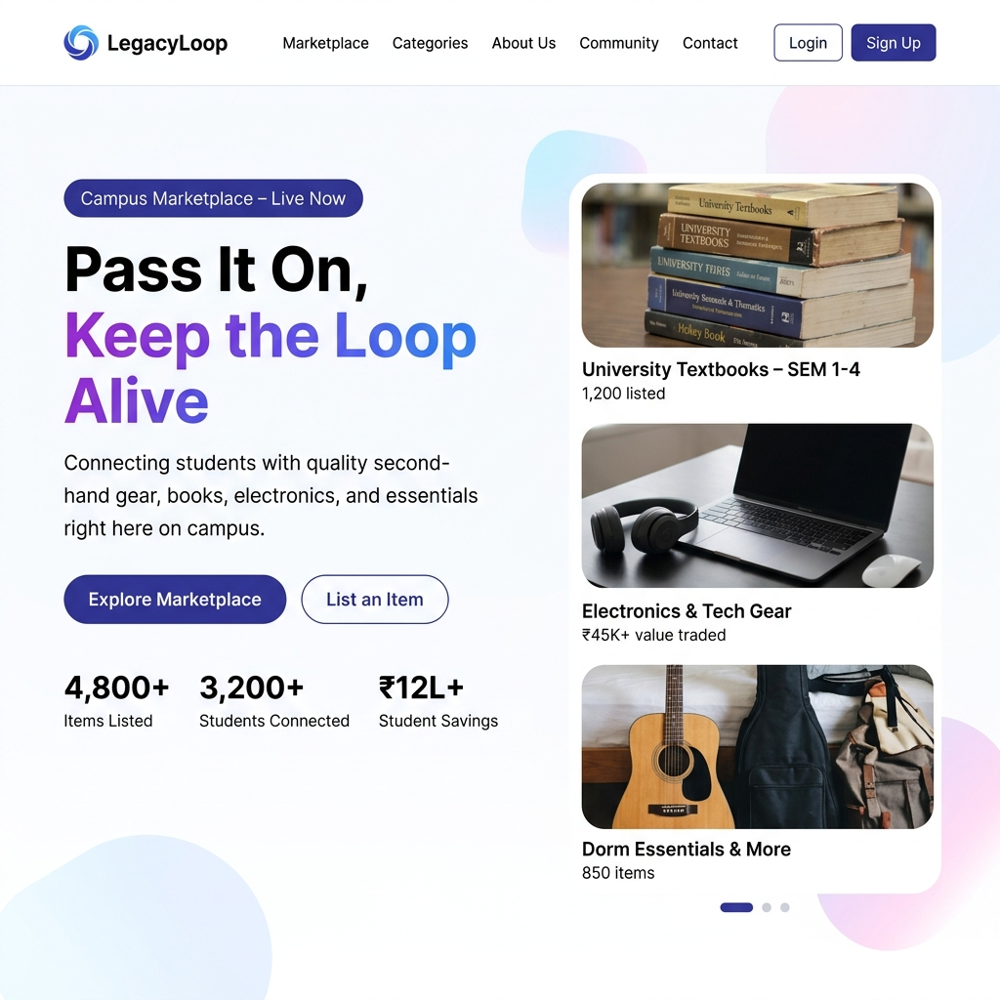
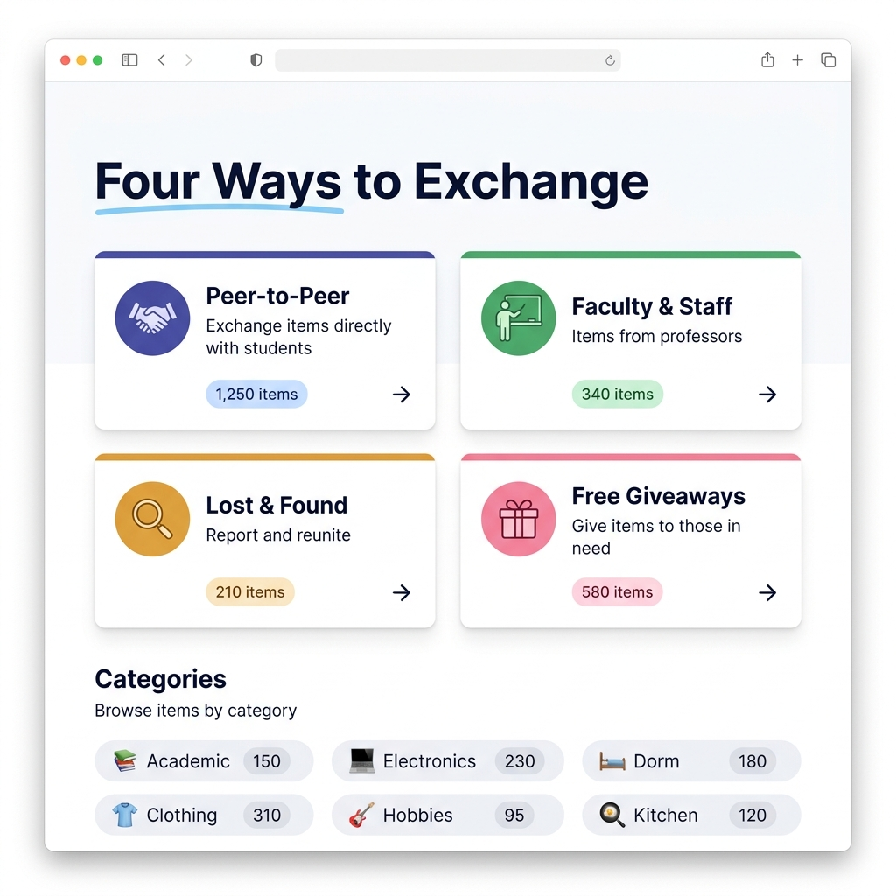
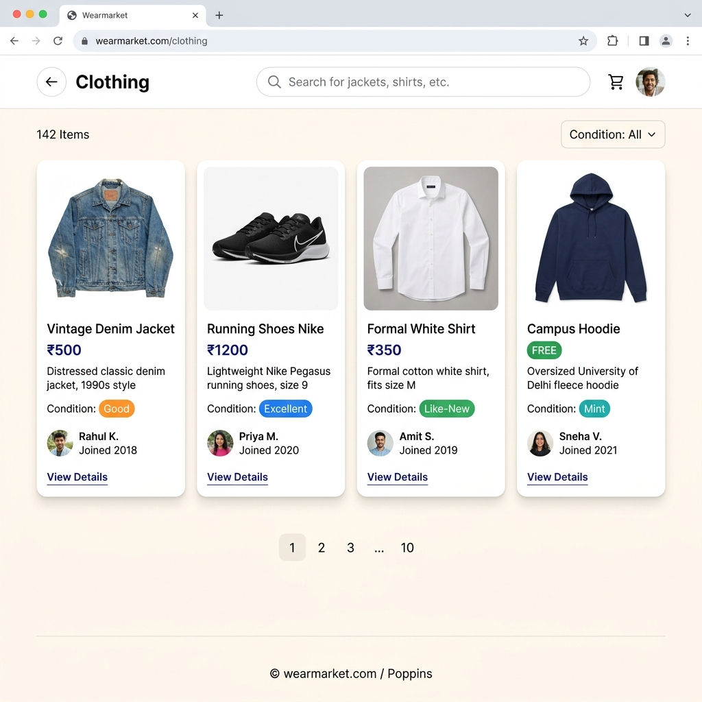

# 🔁 LegacyLoop — Campus Marketplace

> **Pass it on. Keep the loop alive.**

A campus-exclusive marketplace connecting students to exchange textbooks, dorm essentials, electronics, clothing, and more — all within your campus community. Built with React + Vite and a warm, bright modern UI.

---

## ✨ Screenshots

### 🏠 Landing Page — Hero Section


### 🧩 Features & Categories


### 🛒 Marketplace — Product Listings


---

## 🚀 Features

- **4 Exchange Sections**: Peer-to-Peer, Faculty & Staff, Lost & Found, Free Giveaways
- **6 Item Categories**: Academic 📚, Electronics 💻, Dorm Essentials 🛏️, Clothing 👕, Kitchen 🍳, Hobbies 🎸
- **Dynamic Landing Page**: Auto-advancing product carousel, scroll-reveal animations, testimonials
- **Wishlist Board**: Post requests for items you're looking for
- **Graduating Soon**: Special section for seniors leaving campus
- **Search & Filter**: Find items quickly by category, condition, and keywords
- **22+ Demo Products**: Pre-seeded with realistic items across all categories
- **Modern UI**: Bright warm theme with smooth animations and fully responsive design
- **Zero Backend**: Runs entirely on `localStorage` — no server or database needed

## 📋 Prerequisites

- Node.js (v16 or higher)
- npm or yarn

## 🔧 Quick Start

### 1. Clone the repository

```bash
git clone https://github.com/Ayushgupta0511/LegacyLoop.git
cd LegacyLoop
```

### 2. Install dependencies

```bash
npm install
```

### 3. Start development server

```bash
npm run dev
```

The app will be available at **http://localhost:5173**

### 4. Build for production

```bash
npm run build
```

## 🎨 Tech Stack

| Layer | Technology |
|-------|-----------|
| **Framework** | React 18 + Vite |
| **Routing** | React Router v6 |
| **Styling** | Vanilla CSS with CSS Variables |
| **Typography** | Outfit (headings) + Inter (body) via Google Fonts |
| **Storage** | Browser `localStorage` |
| **Animations** | CSS Keyframes + IntersectionObserver scroll reveals |

## 📂 Project Structure

```
LegacyLoop/
├── public/
│   └── images/          # Hero carousel product images (AI-generated)
├── src/
│   ├── components/
│   │   ├── Landing/     # LandingPage (hero, features, testimonials, CTA)
│   │   ├── Dashboard/   # Dashboard, CategoryGrid
│   │   ├── Items/       # ItemList, ItemCard, AddItem
│   │   ├── Features/    # WishlistBoard, GraduatingSoon
│   │   └── Layout/      # Navbar
│   ├── App.jsx          # Routes + demo data seeding
│   └── App.css          # Design system (CSS variables, global styles)
├── docs/
│   └── screenshots/     # README screenshots
├── index.html
└── package.json
```

## 📱 How It Works

1. **Browse** — Land on the homepage → Explore featured sections and categories
2. **Discover** — Pick a section (Peer-to-Peer, Faculty, etc.) → Select a category → View items
3. **List** — Click "List an Item" → Fill in title, description, price, condition → Submit
4. **Wishlist** — Post requests for items you're looking for on the Wishlist Board
5. **Graduating?** — Check the "Graduating Soon" section for deals from seniors

## 🌐 Deployment

### Vercel (Recommended)

1. Push to GitHub
2. Import repo on [vercel.com](https://vercel.com)
3. Framework: **Vite** → Deploy ✅

### Netlify

1. Build command: `npm run build`
2. Publish directory: `dist`

### GitHub Pages

```bash
npm install -D gh-pages
npx gh-pages -d dist
```

## 🎯 Design Highlights

- **Bright warm theme** — White/indigo palette with amber and pink accents
- **Frosted glass navbar** — Transparent on landing, solid on inner pages
- **Hero carousel** — 5 AI-generated product images with auto-advance and dot navigation
- **Scroll-reveal animations** — Sections fade in as you scroll
- **Category-specific fallback data** — Each category shows relevant demo products
- **Responsive** — Fully adapts from desktop to mobile

## 🐛 Troubleshooting

### Items not showing?
Your browser may have old `localStorage` data. The app auto-updates demo data using a version key (`v3`). If issues persist:
```
Open DevTools → Application → Local Storage → Clear legacyloop_items
```
Then refresh the page.

### Build errors?
```bash
rm -rf node_modules package-lock.json
npm install
npm run build
```

## 📄 License

MIT License — feel free to use this for your hackathon and beyond!

## 🤝 Contributing

This is a hackathon project. Feel free to fork and improve!

---

**Built with 💜 for students, by students**
